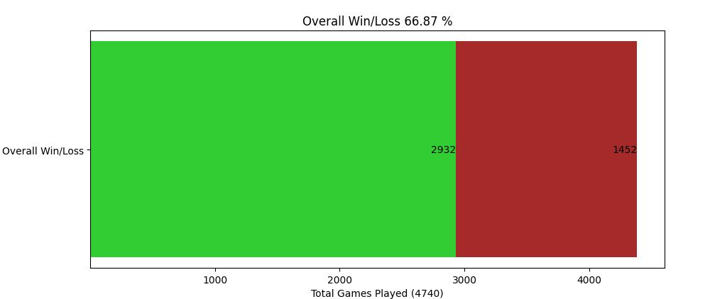
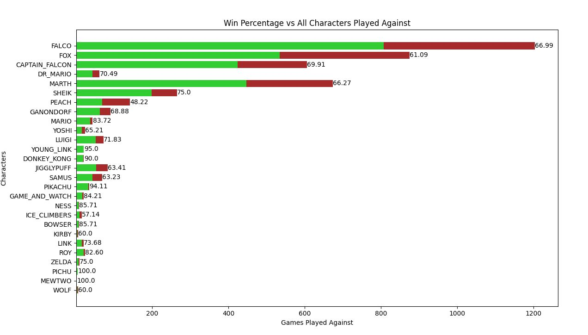
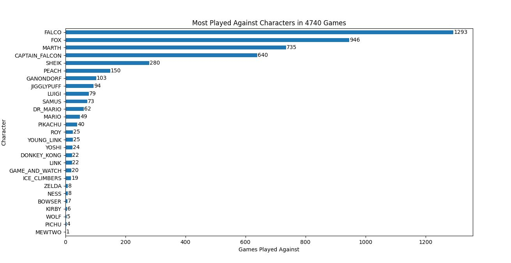

# **Slippi Visualization**

Slippi Visualization is a program that analyzes [.slp][0] game replay files, generated via [Project Slippi][1].
These replay files for the game Super Smash Brothers Melee for the Nintendo Gamecube.
All files were analyzed using the [py-slippi][2] API.

Slippi Visualiztion allows the user to see their overall stats, as graphs, of things like: overall win percentage,
win percentage vs every character, and frequency of characters played against. In addition,
it also allows the user to see all of their opponents played and then view the same stats for that opponent,
ex: overall win percentage vs that opponent, win percentages vs each of that opponents characters, 
and frequency of opponents character selection. 

## **How To**

The program needs a folder that contains all the .slp files that you would like to analyze. It also needs
a .txt file somewhere that contains all the users' names that they have used on netplay, each on its own line.

Ex "names.txt":

    netplayname1
    netplayname2
    netplayname3

Then, when run the program will ask for the location of the replay folder, and the names text file. 
It will also ask if the user would like to analyze new data. If the program hasn't 
been run before, or the user selects 'Yes', the program will analyze the replay data and create a new csv file. 
This allows the analysis to be faster if the user wants to analyze the same replays again. Note that if there
are new replays which the user wants to analyze they must select 'Yes', to create new data prompt,
in order to have them considered.

## **Graphs**

[Overall Win Percentage][3]

[Win Percentage vs Every Character][4]

[Frequency of Characters Played Against][5]

[0]: https://github.com/project-slippi/slippi-wiki/blob/master/SPEC.md

[1]: https://github.com/project-slippi/project-slippi

[2]: https://github.com/hohav/py-slippi

[3]: images/overallWL.JPG?raw=true

[4]: images/charWL.JPG

[5]: images/charFreq.JPG
